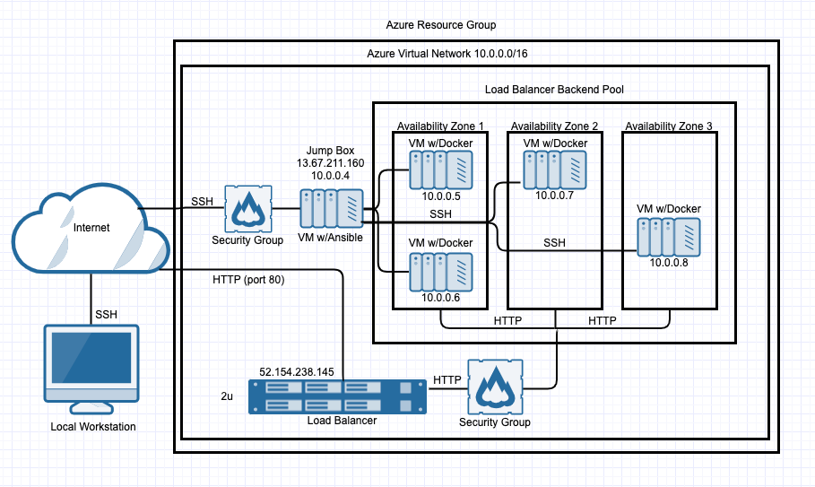
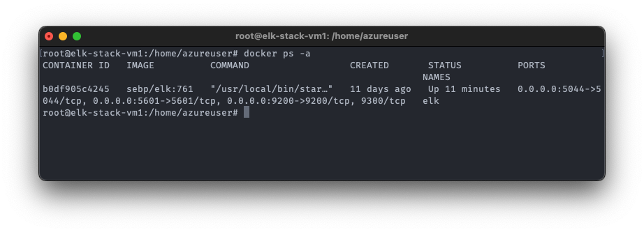

## Automated ELK Stack Deployment

The files in this repository were used to configure the network depicted below.



These files have been tested and used to generate a live ELK deployment on Azure. They can be used to either recreate the entire deployment pictured above. Alternatively, select portions of the YAML file may be used to install only certain pieces of it, such as Filebeat.

  - [Filebeat Playbook](Ansible/filebeat-playbook.yml)

This document contains the following details:
- Description of the Topologu
- Access Policies
- ELK Configuration
  - Beats in Use
  - Machines Being Monitored
- How to Use the Ansible Build


### Description of the Topology

The main purpose of this network is to expose a load-balanced and monitored instance of DVWA, the D*mn Vulnerable Web Application.

Load balancing ensures that the application will be highly available, in addition to restricting access to the network.
- It maximizes the availability of the web servers, at the same time minimizes the attack surface by opening only the Jump Box machine to be public accessible via SSH by whitelisted IPs

Integrating an ELK server allows users to easily monitor the vulnerable VMs for changes to the files and system usage.
- File system changes, file created/deleted etc.
- Metrics such as CPU/RAM usage, network activity, system load etc.

The configuration details of each machine may be found below.

| Name     | Function          | IP Address | Operating System |
|----------|-------------------|------------|------------------|
| Jump Box | Gateway           | 10.0.0.4   | Linux            |
| Web1     | Webserver1        | 10.0.0.5   | Linux            |
| Web2     | Webserver2        | 10.0.0.6   | Linux            |
| ELK      | ELK stack server  | 10.1.0.4   | Linux            |

### Access Policies

The machines on the internal network are not exposed to the public Internet.

Only the JumpBox machine can accept connections from the Internet. Access to this machine is only allowed from the following IP addresses:
- Personal machine's public IP

Machines within the network can only be accessed by the JumpBox.
- The ELK VM and the two web server VMs are in different subnets (10.1.0.0/24 and 10.0.0.0/24, respectively) and access between the two are allowed.

A summary of the access policies in place can be found in the table below.

| Name     | Publicly Accessible   | Allowed IP Addresses                           |
|----------|-----------------------|------------------------------------------------|
| Jump Box | Yes                   | Personal machine's public IP                   |
| Web1     | Yes via LB on port 80 | Port80: all; SSH: 10.0.0.0/24, 10.1.0.0/24     |
| Web2     | Yes via LB on port 80 | Port80: all; SSH: 10.0.0.0/24, 10.1.0.0/24     |
| ELK      | No                    | SSH: 10.0.0.0/24, 10.1.0.0/24                  |

### Elk Configuration

Ansible was used to automate configuration of the ELK machine. No configuration was performed manually, which is advantageous because...
- Make repetitive tasks such as updating/installing packages on multiple servers

The playbook implements the following tasks:
- Install docker using the Anisble's `apt` module
- Install python3-pip using the Anisble's `apt` module
- Install pip3 docker module
- Set maximum virtual memory to 262144
- Create a Docker container using the sebp/elk:761 image with proper ports mappings
- Make docker to start on boot

The following screenshot displays the result of running `docker ps` after successfully configuring the ELK instance.



### Target Machines & Beats
This ELK server is configured to monitor the following machines:
- Webserver1:10.0.0.5
- Webserver2:10.0.0.6

We have installed the following Beats on these machines:
- Filebeat and Metricbeat on both web servers

These Beats allow us to collect the following information from each machine:
- Filebeat collects file system changes and other system events
- Metricbeat collects CPU/RAM usage, system load, network activities

### Using the Playbook
In order to use the playbook, you will need to have an Ansible control node already configured. Assuming you have such a control node provisioned:

SSH into the control node and follow the steps below:
- Copy the playbook files to `/etc/ansible` and config files for Filebeat and Metricbeat into `/etc/ansible/files`.

- Update the `hosts` file to include IPs of the target machines as groups, and refer to the corresponding group names in the playbooks
```
# hosts
[elk]
10.1.0.4 ansible_python_interpreter=/usr/bin/python3
```
``` yml
#elk stack vm playbook
---
- name: Configure Elk VM with Docker
  hosts: elk
```

- Run the playbook, and navigate to the LB's public IP to check that the installation worked as expected.
```bash
$ ansible-playbook /etc/ansible/install-elk.yml
$ ansible-playbook /etc/ansible/metricbeat-playbook.yml
$ ansible-playbook /etc/ansible/filebeat-playbook.yml
```
